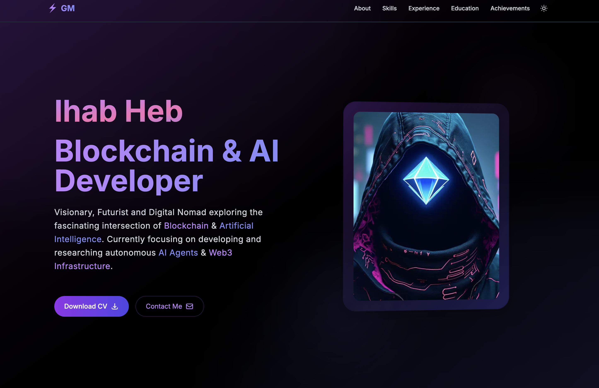

# Ihab Heb - Blockchain & AI Developer Portfolio

## 🚀 Overview

A modern, responsive portfolio showcasing my expertise as a Blockchain & AI Developer. This portfolio highlights my projects, skills, and professional journey at the intersection of blockchain technology and artificial intelligence.

## 👨‍💻 About Me

I'm Ihab Heb, a visionary technologist with deep expertise in blockchain development, AI integration, and full-stack web development. I focus on creating secure, scalable, and innovative solutions that bridge the gap between decentralized systems and intelligent automation.

## 🔥 Key Features

- 🌓 Seamless Dark/Light mode with smooth transitions
- 📱 Fully responsive design for all devices
- 💫 Elegant animations with Framer Motion
- 🎨 Modern UI with animated gradient backgrounds
- 🚀 Optimized performance with Next.js 15
- 🔍 SEO-friendly structure
- 🌐 Web3 integration showcasing blockchain projects
- 🤖 AI project highlights

## 💻 Technical Expertise

### Blockchain

- Smart Contracts Development & Security
- Web3 & DeFi
- Solidity, Teal, Cairo
- EVM, Algorand, Starknet, Cosmos IBC, Solana
- NFTs, DAOs, RWA

### Software Development

- Full Stack Web Development
- TypeScript, Node.js, React, Next.js
- REST APIs, GraphQL
- MongoDB, Supabase
- Docker, Vercel, CI/CD, AWS

### AI & Research

- LLM Integration & RAG
- Agentic Frameworks
- Decentralized Computing [GPU]
- Autonomous Agents
- AI Inference

## 🏆 Achievements & Recognition

- Mode AI Founders Incubation Top 3
- FutureHack Gitex Top Creative Concept
- EthGlobal SuperHack Zora Best Use
- Eth Online Tableland and Unstoppable Domains Pool Prize
- EthSafari WorldCoinID & Coinbase Prize
- HackMoney Transak Pool Prize Winner
- HackTheBox Cysec Global CTF Winner
- CARE-X Trail of Bits Echidna Top 7

## 🎓 Education

- 42 Abu Dhabi - Software Engineering
- Hassan II University - Theoretical Physics

## 🛠️ Tech Stack

This portfolio is built with:

- **Next.js 15** - React framework with App Router
- **TypeScript** - For type safety and better developer experience
- **Tailwind CSS** - For responsive, utility-first styling
- **Framer Motion** - For smooth animations and transitions
- **React Icons** - For beautiful, consistent iconography
- **Next Themes** - For dark/light mode implementation

## 📞 Contact

- **Email**: Ihab.Hormi@hotmail.com
- **Location**: Casablanca, Morocco
- **Schedule a Meeting**: [Calendly](https://calendly.com/ihab-heb/collab)

## 🔗 Connect With Me

- [GitHub](https://github.com/hebx)
- [LinkedIn](https://www.linkedin.com/in/ihab-hormi-552b63219/)
- [Twitter](https://x.com/lordheb)
- [Telegram](https://t.me/lord_heb)
- [Farcaster](https://warpcast.com/lordheb.eth)
- [Lens](https://hey.xyz/u/@lordheb)
- [Basename](https://www.base.org/name/lordheb)
- [Talent Protocol](https://app.talentprotocol.com/profile/2912579)

## 📄 License

This project is licensed under the MIT License.
