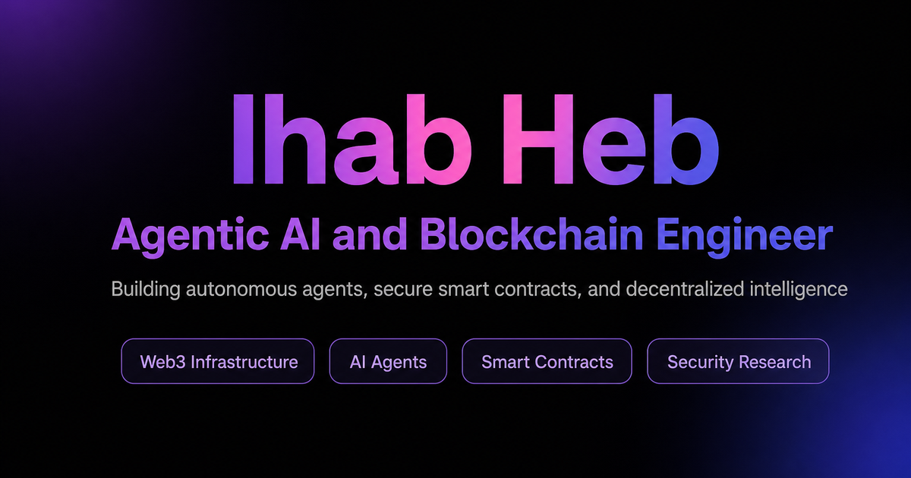

# lordheb.com — Ihab Hormi (Hebx / 0xHeb)

> Agentic AI & Blockchain Engineer. Building autonomous agents, agentic commerce protocols, and verifiable on-chain infrastructure.

<p align="center">
  <a href="https://lordheb.com"><strong>🌐 lordheb.com</strong></a> ·
  <a href="https://glorianlabs.com">Glorian Labs</a> ·
  <a href="https://github.com/Hebx">GitHub</a> ·
  <a href="https://x.com/lordheb">X</a> ·
  <a href="https://www.linkedin.com/in/ihab-hormi-552b63219/">LinkedIn</a> ·
  <a href="https://t.me/lord_heb">Telegram</a> ·
  <a href="https://www.base.org/name/lordheb">lordheb.base.eth</a>
</p>



<p align="center">
  
  
  
  
  
  
  
</p>

---

## 🚀 About

Personal portfolio (devfolio, not a CV) of **Ihab Hormi** — also known as **lordheb**, **Hebx**, **0xHeb**.

A futurist by instinct, a visionary by craft — translating the next decade of decentralized AI, verifiable coordination, and machine-native economies into working systems: hackathon & grants winning builds, protocol R&D, secure smart contracts, and production-grade products.

Founder of **[Glorian Labs](https://glorianlabs.com)** — an early-stage AI agency & Web3 startup engineering autonomous coordination, agentic commerce, and verifiable infrastructure across decentralized networks. Day job: shipping AI-native full-stack platforms.

**Currently open to:** senior engineering roles, protocol R&D, smart contract audits, Web3 grants, and agentic AI collaborations.

## 🔥 Selected Recognition

- 🏆 **Hedron** — Hedera Africa Hackathon Top 3 (AI & DePIN), 1,300+ submissions, $30K prize
- 🏆 **Mode Network** AI Founders Incubation — Top 3
- 🛡️ **CARE-X** · Trail of Bits Echidna — Top 7 (Secureum)
- 🏆 **HackTheBox** Cysec Global CTF — Winner
- 🌐 **EthGlobal** — SuperHack (Zora Best Use), ETHOnline & HackMoney pool prizes
- 🎓 **Kernel Fellow** KB8 (Gitcoin)
- 🦀 **RektOff** Rust Security Bootcamp graduate
- 🦄 **Uniswap Hook Incubator** · Atrium Academy Cohort 8
- 🎤 **Certificate of Contribution** as a guest speaker (UTAS Blockchain Event · University of Oman)

## 🧪 Featured Builds (Proof of Work)

| Project | What | Status |
| --- | --- | --- |
| **Hedron** | Hedera-native agentic commerce SDK — A2A, AP2, HCS-10, x402 | v0.2 · Alpha |
| **AgentGuard** | Tether WDK middleware: deterministic policy + ed25519 receipts for any wallet | Beta · npm |
| **HashTrail** | Plain-language Hedera tipping agent — HBAR + HTS NFT + HCS receipt | Live · Mainnet |
| **LiquidMind** | AI-driven liquidity for Uniswap v4 · hook + Chainlink CRE | Research |
| **Ascent CLI** | Aptos toolkit: x402 USDC + AAIS identity + AgentMesh | Beta · npm |
| **Proof0G** | Portable Proof Pages for 0G AI apps · 0G Storage + Chain + Compute | Public · TS |
| **Proof of Verdict** | Trustless AI judge for agent disputes · TEE-signed verdicts | Public · Solidity |
| **TrustScore Oracle** | Hedera trust scores via Arkhia, paid per query (x402) | v0.1 · Testnet |

## 🧠 Technical Surface

**Blockchain & Protocols** — Solidity · Smart Contracts · EVM · Foundry · Hardhat · Hedera/HCS · Solana · Uniswap v4 Hooks · Chainlink · Cairo/Starknet · Cosmos IBC · Rust · Move/Aptos

**Agentic AI** — Autonomous agents · A2A / AP2 / MCP · x402 · RAG · LLM integration · decentralized AI · DePIN compute · verifiable inference

**Security Research** — Smart contract auditing · Rust security · offensive security · fuzzing (Echidna) · on-chain analysis · OpSec

**Full-Stack Web** — TypeScript · React · Next.js · Node.js · TanStack · OpenAPI · Authentik · MongoDB · Supabase · Docker · Vercel · AWS

## 🧱 Tech Stack (this site)

| Layer | Tool |
| --- | --- |
| Framework | Next.js 15 (App Router, Turbopack) |
| Language | TypeScript 5 |
| Styling | Tailwind CSS 3 |
| Animations | Framer Motion 12 |
| Theming | next‑themes (dark default) |
| Icons | react‑icons · lucide‑react |
| Deploy | Vercel |

## ✨ Features

- 🌓 Dark / light mode with smooth transitions
- 📱 Fully responsive across phone → desktop
- 💫 Framer-Motion entrance, scroll, and hover animations
- 🎨 Animated gradient backgrounds with reusable section primitives
- 🔍 Rich SEO: Open Graph + Twitter cards, JSON-LD Person + WebSite schema, sitemap & robots
- ⚡ Lighthouse 94 / 100 / 100 / 100 — Perf · A11y · Best Practices · SEO
- 🧩 Zero‑CLS layout, prioritized hero LCP image
- ♿ Accessible landmarks, semantic HTML, screen-reader friendly alt text

## 📐 Project Structure

```text
app/
├─ components/
│  ├─ Hero.tsx           # Headline, badges, CTAs, profile portrait
│  ├─ About.tsx          # Story + social/identity graph
│  ├─ Projects.tsx       # Proof of Work — featured builds & research
│  ├─ Skills.tsx         # Skill clusters
│  ├─ Experience.tsx     # Roles & engagements
│  ├─ Education.tsx      # 42 Abu Dhabi · Hassan II
│  ├─ Achievements.tsx   # Recognition + Certifications
│  ├─ Navbar.tsx         # Sticky nav + theme toggle
│  ├─ Footer.tsx         # Manifesto + socials + Calendly
│  └─ SectionBackground.tsx
├─ layout.tsx            # Root layout + metadata + JSON-LD
├─ page.tsx              # Section composition
├─ robots.ts             # /robots.txt
├─ sitemap.ts            # /sitemap.xml
└─ globals.css
public/Images/           # Optimized assets (hero, about, OG preview)
```

## 🛠️ Local Development

Requirements: **Node.js ≥ 18.18** and **npm ≥ 9** (or pnpm / yarn / bun — adapt scripts).

```bash
git clone https://github.com/Hebx/DevFolio.git
cd DevFolio
npm install
npm run dev          # http://localhost:3000
```

### Scripts

```bash
npm run dev      # Next dev server (Turbopack)
npm run build    # Production build
npm run start    # Run the production build
npm run lint     # ESLint
```

## 🚢 Deployment

Auto-deployed to **[lordheb.com](https://lordheb.com)** via Vercel on every push to `Main`.

To deploy your own fork:

```bash
npx vercel        # link & preview
npx vercel --prod # production deploy
```

## 📊 Lighthouse (mobile, throttled)

| Metric | Score |
| --- | --- |
| Performance | **94** |
| Accessibility | **100** |
| Best Practices | **100** |
| SEO | **100** |

Core Web Vitals: **FCP 0.9 s · LCP 2.9 s · TBT 120 ms · CLS 0**

## 📞 Contact

- **Email** — [Ihab.Hormi@hotmail.com](mailto:Ihab.Hormi@hotmail.com)
- **Telegram** — [@lord_heb](https://t.me/lord_heb)
- **Schedule** — [calendly.com/ihab-heb/collab](https://calendly.com/ihab-heb/collab)
- **Location** — Casablanca, Morocco · remote-friendly worldwide

## 🔗 Identity Graph

- [LinkedIn](https://www.linkedin.com/in/ihab-hormi-552b63219/) · [X / Twitter](https://x.com/lordheb) · [Telegram](https://t.me/lord_heb) · [GitHub](https://github.com/Hebx)
- [Glorian Labs](https://glorianlabs.com) · [Basename: lordheb.base.eth](https://www.base.org/name/lordheb) · [Talent Protocol](https://app.talentprotocol.com/profile/2912579)

## 📄 License

[MIT](./LICENSE) © Ihab Hormi
