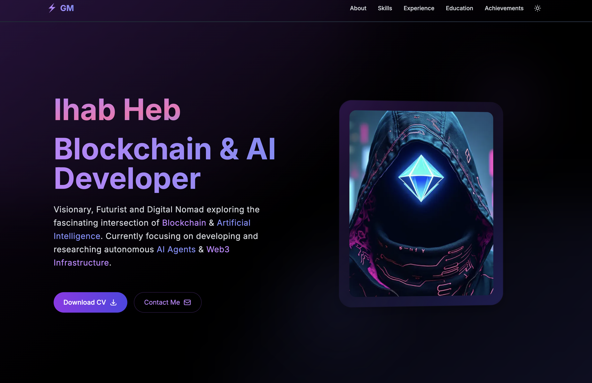

# Ihab Heb / Hebx — Blockchain Engineer & AI Agent Infrastructure Builder

## 🚀 Overview

Personal portfolio for Ihab / Hebx, a blockchain engineer, full-stack developer, and AI agent infrastructure builder working across Web3 systems, autonomous agents, smart contracts, security research, and protocol-oriented products.

## 👨‍💻 About Me

Visionary technologist and futurist builder operating at the intersection of blockchain engineering, AI agents, full-stack engineering, Web3 infrastructure, and security research. Currently running active founder-led R&D through **Glorian Labs**, an early-stage agentic agency and AI × Web3 startup, while contributing as a full-stack engineer at **DataPhleet**.

Recent highlights:

- 🏆 **Hedron** — Hedera Africa Hackathon Top 3 (AI & DePIN), Hedera-native SDK for agentic commerce
- 🦀 **RektOff** Rust Security Bootcamp
- 🦄 **Uniswap Hook Incubator** Cohort 8
- ☀️ Solana Developer Certification

## 🔥 Key Features

- 🌓 Seamless Dark/Light mode with smooth transitions
- 📱 Fully responsive design for all devices
- 💫 Elegant animations with Framer Motion
- 🎨 Modern UI with animated gradient backgrounds
- 🚀 Optimized performance with Next.js 15
- 🔍 SEO-friendly structure
- 🌐 Web3 integration showcasing blockchain projects
- 🤖 AI project highlights

## 💻 Technical Expertise

### Blockchain & Protocol

- Smart contracts, Solidity, EVM, Hedera / HCS, Solana, Uniswap v4 Hooks, Chainlink
- ZK / proof systems, x402, A2A / MCP
- Cairo / Starknet, Cosmos IBC, Rust

### Software & Full-Stack

- TypeScript, React, Next.js, Node.js
- TanStack Router, OpenAPI SDKs, Auth / Authentik
- REST/GraphQL, MongoDB, Supabase, Docker, Vercel, AWS

### AI Agents, Security & Research

- AI agents, agentic workflows, LLM integration, RAG
- Decentralized AI, decentralized compute, autonomous agents
- Smart contract security, Rust security, protocol research

### AI & Research

- LLM Integration & RAG
- Agentic Frameworks
- Decentralized Computing [GPU]
- Autonomous Agents
- AI Inference

## 🏆 Achievements & Recognition

- Mode AI Founders Incubation Top 3
- FutureHack Gitex Top Creative Concept
- EthGlobal SuperHack Zora Best Use
- Eth Online Tableland and Unstoppable Domains Pool Prize
- EthSafari WorldCoinID & Coinbase Prize
- HackMoney Transak Pool Prize Winner
- HackTheBox Cysec Global CTF Winner
- CARE-X Trail of Bits Echidna Top 7

## 🎓 Education

- 42 Abu Dhabi - Software Engineering
- Hassan II University - Theoretical Physics

## 🛠️ Tech Stack

This portfolio is built with:

- **Next.js 15** - React framework with App Router
- **TypeScript** - For type safety and better developer experience
- **Tailwind CSS** - For responsive, utility-first styling
- **Framer Motion** - For smooth animations and transitions
- **React Icons** - For beautiful, consistent iconography
- **Next Themes** - For dark/light mode implementation

## 📞 Contact

- **Email**: Ihab.Hormi@hotmail.com
- **Location**: Casablanca, Morocco
- **Schedule a Meeting**: [Calendly](https://calendly.com/ihab-heb/collab)

## 🔗 Connect With Me

- [GitHub](https://github.com/hebx)
- [LinkedIn](https://www.linkedin.com/in/ihab-hormi-552b63219/)
- [Twitter](https://x.com/lordheb)
- [Telegram](https://t.me/lord_heb)
- [Farcaster](https://warpcast.com/lordheb.eth)
- [Lens](https://hey.xyz/u/@lordheb)
- [Basename](https://www.base.org/name/lordheb)
- [Talent Protocol](https://app.talentprotocol.com/profile/2912579)

## 📄 License

This project is licensed under the MIT License.
